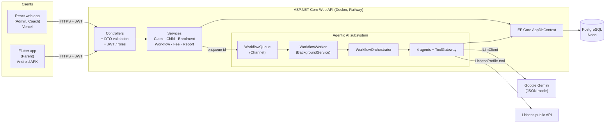
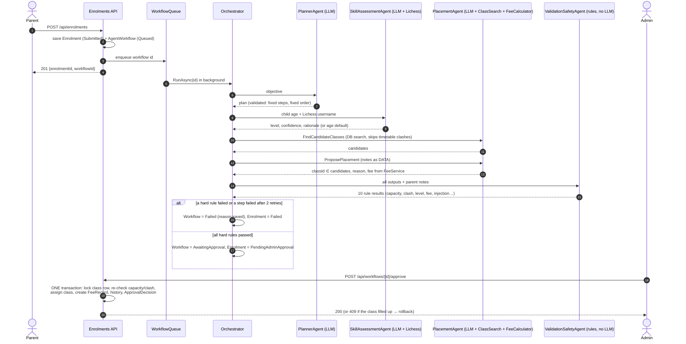
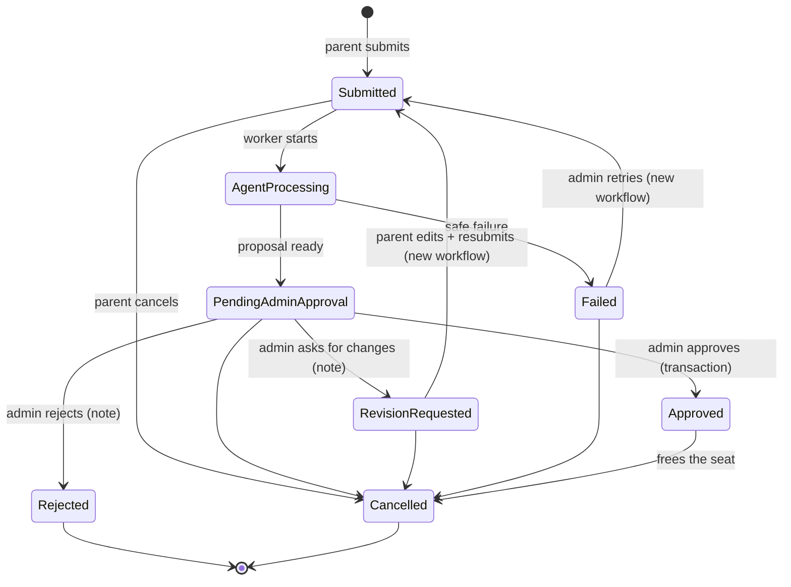
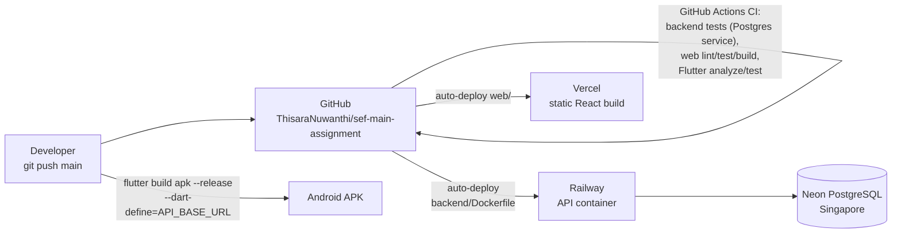

# Architecture diagrams

## 1. System architecture

The clients only ever talk to the API. The API is layered: **Controllers → DTOs → Services → EF Core**, all wired by dependency
injection. Errors from any layer become ProblemDetails in one `GlobalExceptionHandler`.

## 2. Agent workflow (one enrolment)

Every step and tool call is saved as it happens (`AgentSteps`, `ToolCalls`), so the Admin review page shows the
full trail, including failed attempts and timings.

## 3. Enrolment status life cycle

Enforced in code by `EnrolmentStateMachine` (any other move → 409), and every move writes an `EnrolmentStatusHistory` row.

## 4. Deployment

