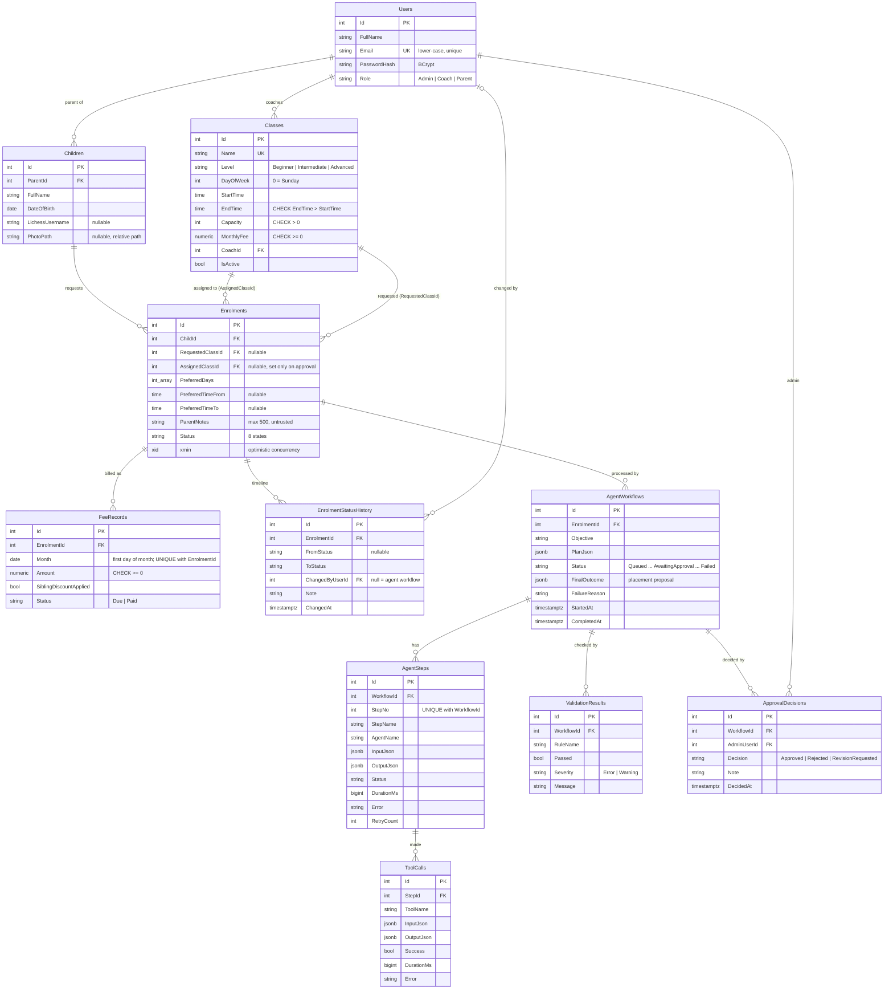

# Database design (PostgreSQL via EF Core)

Every table also has `Id` (PK), `CreatedAt` and `UpdatedAt` (set automatically in `AppDbContext.SaveChangesAsync`).
Enums are stored as text, except `DayOfWeek` (integer, so it sorts in week order).

## Constraints and indexes

| Kind | Where | Why |
|---|---|---|
| Unique | `Users.Email`, `Classes.Name`, `(FeeRecords.EnrolmentId, Month)`, `(AgentSteps.WorkflowId, StepNo)` | no duplicate accounts/classes; approving twice cannot double-bill |
| Check | `Capacity > 0`, `MonthlyFee >= 0`, `EndTime > StartTime`, `FeeRecords.Amount >= 0` | the database rejects impossible data even if the API has a bug |
| Index | `Enrolments.Status`, `Enrolments.ChildId`, `(Enrolments.AssignedClassId, Status)` | status filters, "open request" check, seat counting |
| Index | `(Classes.Level, DayOfWeek)`, `Classes.CoachId` | ClassSearch tool, coach roster |
| Index | FKs on `Children`, `AgentWorkflows`, `AgentSteps`, `ToolCalls`, `ValidationResults`, `ApprovalDecisions`, `EnrolmentStatusHistory` | loading a workflow / history quickly |
| Concurrency | `Enrolments.xmin` | two admins cannot both change the same enrolment |
| Delete rules | Restrict on Class → Coach and Enrolment → Child/Class; Cascade on workflow children | history is never silently lost |

Migrations: `backend/src/SkcaEnrol.Api/Data/Migrations` (`InitialCreate`, `AgentWorkflowState`), applied automatically on startup.
